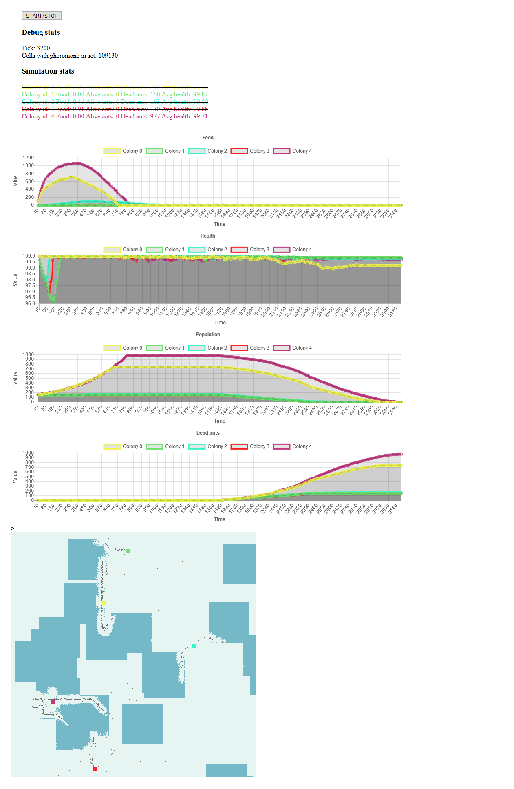
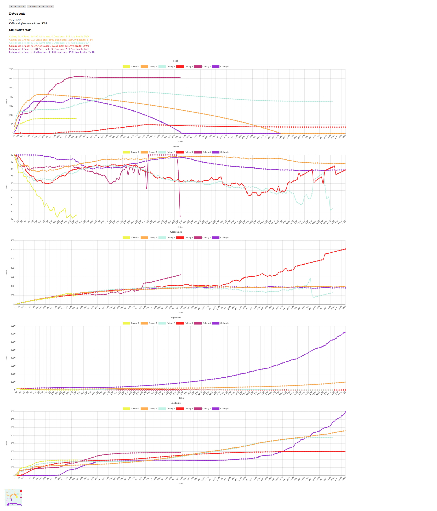

# Ant Simulator

The only thing you have to do is to enter the `app` folder and open `index.html` in a browser!

To change the configurations modify the `config.js` file.

Have fun!

### Preview

## Sample Tests

You can find the configuration files for these tests in the `runs` folder.

### Test run 1

No fighting between different colonies.

---

### Test run 2

No fighting between different colonies.

---

### Test run 3

Fighting involved between different colonies.

